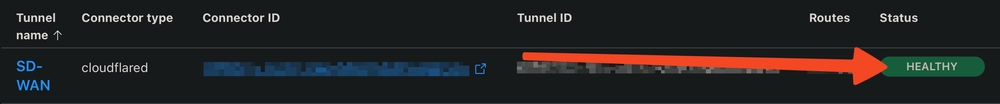
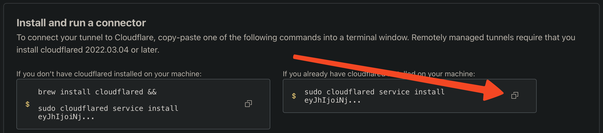

Getting Cloudflare's `cloudflared` CLI tool working with FreeBSD (and variants)
is easy, but completely undocumented online. Below are instructions (with some
background) on how to get it working with remotely-managed Cloudflare Zero Trust
tunnels!

My goals to get `cloudflared` tunnel working on FreeBSD were that it should:

- Run as a service.
- Be remotely-managed from Cloudflare Zero Trust, like Linux, Windows, and
  macOS.
- Not require any third-party dependencies.

> If you only care about the fix and not the process of getting there, feel free
> to use the table of contents to skip to **Step-by-step instructions** below.

## Contents

## Background

Cloudflare's `cloudflared` CLI tool
[has been officially available for FreeBSD](https://www.freshports.org/net/cloudflared/)
since late 2019, but getting it to work with Cloudflare's Zero Trust tunnels has
never been as straight-forward to set up as it has been for other operating
systems.

There have been quite a few workarounds since it was first published, but many
of these workarounds require trusting third-party code and configurations.
Of course, this isn't always feasible — much less desirable — in a business
context (or for those who are conscientious with their privacy).

What would it take to do better? Not much, as it turns out — all the parts are
there, we just need to put them together!

## Investigation

### Reproducing the issue

The main issue stems from the fact that, after installing `cloudflared` (either
via `pkg` or building from source), the
[normal initialization command](https://developers.cloudflare.com/cloudflare-one/connections/connect-networks/configure-tunnels/local-management/as-a-service/linux/)
provided during Cloudflare tunnel setup returns the following error message on
FreeBSD systems:

```console
$ cloudflared service install eyJhIjoiNj...
You did not specify any valid additional argument to the cloudflared tunnel command.

If you are trying to run a Quick Tunnel then you need to explicitly pass the --url flag.
Eg. cloudflared tunnel --url localhost:8080/.

Please note that Quick Tunnels are meant to be ephemeral and should only be used for testing purposes.
For production usage, we recommend creating Named Tunnels. (https://developers.cloudflare.com/cloudflare-one/connections/connect-apps/install-and-setup/tunnel-guide/)
```

Which, fair enough, FreeBSD _isn't_ Linux, so finding some discrepancies here is
only to be expected. Back to the error message: at first glance, this message
seems completely unrelated to what we requested `cloudflared` to do.

What happens if we attempt to run the service without any additional
configuration? We'll use `onestart` since we're still testing things out:

```console
$ service cloudflared onestart
Starting cloudflared.
$ service cloudflared onestatus
cloudflared is not running.
```

Well, looks like the process probably crashed immediately. Luckily,
`cloudflared` is well-behaved and writes its logs to `/var/log/cloudflared.log`.
Reviewing those logs shows the same error as before:

```console
$ tail /var/log/cloudflared.log
You did not specify any valid additional argument to the cloudflared tunnel command.

If you are trying to run a Quick Tunnel then you need to explicitly pass the --url flag.
Eg. cloudflared tunnel --url localhost:8080/.

Please note that Quick Tunnels are meant to be ephemeral and should only be used for testing purposes.
For production usage, we recommend creating Named Tunnels. (https://developers.cloudflare.com/cloudflare-one/connections/connect-apps/install-and-setup/tunnel-guide/)
```

So what's going on here? Why are we getting an error message on FreeBSD when the
same setup command works on other operating systems?

### Reviewing the FreeBSD port

At the time, I wasn't aware that `cloudflared` was
[already open-sourced](https://github.com/cloudflare/cloudflared), so I did a
little digging in the FreeBSD ports tree to find some more info about
it. Turns out this was a good thing, since it provided some additional context
for how the `cloudflared` operates by default on FreeBSD.

Let's peek at the
[contents of the FreshPorts tree for `cloudflared`](https://github.com/freebsd/freebsd-ports/tree/b002f0cb01044615114aac0a95f8add4c78b29a4/net/cloudflared):

```
.
├── Makefile
├── distinfo
├── files/
│   └── cloudflared.in
└── pkg-descr
```

[`distinfo`](https://github.com/freebsd/freebsd-ports/blob/b002f0cb01044615114aac0a95f8add4c78b29a4/net/cloudflared/distinfo)
and
[`pkg-descr`](https://github.com/freebsd/freebsd-ports/blob/b002f0cb01044615114aac0a95f8add4c78b29a4/net/cloudflared/pkg-descr)
only contain port metadata, so let's focus on
[`Makefile`](https://github.com/freebsd/freebsd-ports/blob/b002f0cb01044615114aac0a95f8add4c78b29a4/net/cloudflared/Makefile)
and
[`files/cloudflared.in`](https://github.com/freebsd/freebsd-ports/blob/6398d13aebc737ac6c45bb95cee4dcc9199c32c1/net/cloudflared/files/cloudflared.in).

#### [`Makefile`](https://github.com/freebsd/freebsd-ports/blob/b002f0cb01044615114aac0a95f8add4c78b29a4/net/cloudflared/Makefile)

Okay, so these lines indicate that the source is on GitHub.

```makefile
USE_GITHUB=	yes
...
GO_PKGNAME=	github.com/${GH_ACCOUNT}/${PORTNAME}
```

After subbing in the variables we get
[github.com/cloudflare/cloudflared](https://github.com/cloudflare/cloudflared)
— and oh neat, turns out it's been open-sourced! That saves us some time. Then
the following line tells us where the build target is (and subsequently where we
should start our investigation) — namely,
[`/cmd/cloudflared`](https://github.com/cloudflare/cloudflared/tree/master/cmd/cloudflared).

```makefile
GO_TARGET=	${GO_PKGNAME}/cmd/cloudflared
```

Awesome, we could immediately jump into the source code. While we're here,
though, let's look at the other file we called out above:

#### [`files/cloudflared.in`](https://github.com/freebsd/freebsd-ports/blob/6398d13aebc737ac6c45bb95cee4dcc9199c32c1/net/cloudflared/files/cloudflared.in)

```sh
#!/bin/sh

# PROVIDE: cloudflared
# REQUIRE: cleanvar DAEMON NETWORKING
#
# Options to configure cloudflared via /etc/rc.conf:
#
# cloudflared_enable (bool)	Enable service on boot
#				Default: NO
#
# cloudflared_conf (str)	Config file to use
#				Default: %%ETCDIR%%/config.yml
#
# cloudflared_mode (str)	Mode to run cloudflared as (e.g. 'tunnel', 'tunnel run'
#				or 'proxy-dns'). Should you use the default, a free
#				tunnel is set up for you.
#				Default: "tunnel"

. /etc/rc.subr

name="cloudflared"
rcvar="cloudflared_enable"
logfile="/var/log/cloudflared.log"
pidfile="/var/run/cloudflared.pid"
procname="%%PREFIX%%/bin/cloudflared"

load_rc_config $name

: ${cloudflared_enable:="NO"}
: ${cloudflared_conf:="%%ETCDIR%%/config.yml"}
: ${cloudflared_mode:="tunnel"}

command="/usr/sbin/daemon"
command_args="-o ${logfile} -p ${pidfile} -f ${procname} --config ${cloudflared_conf} ${cloudflared_mode}"

run_rc_command "$1"
```

This is a (pretty simple) service declaration for `rc.d`. The default location
for this file after installation on FreeBSD will be at
`/usr/local/etc/rc.d/cloudflared`.

> If you're unfamiliar with `rc.d` or otherwise curious, there's a good article
> diving into the history and structure of `rc.d` scripts available here:
> [Practical rc.d scripting in BSD](https://docs.freebsd.org/en/articles/rc-scripting/).

A couple of things to note that will be important for later:

- Like all good FreeBSD services, it's disabled by default
  (`: ${cloudflared_enable:="NO"}`).
- Per the inline documentation at the top, `tunnel` is the default service mode
  (`: ${cloudflared_mode:="tunnel"}`).

### Finding the source of the error

So far, we've found the source code for `cloudflared` as well as the `rc.d`
service declaration script. Let's peek at the `cloudflared` source code file
structure, specifically under the
[`cmd/cloudflared`](https://github.com/cloudflare/cloudflared/tree/6174c4588b18e61efc1d9981ec1aa37dfd7cb5e4/cmd/cloudflared)
build target path specified above:

```
.
├── access/
├── cliutil/
├── proxydns/
├── tail/
├── tunnel/
├── updater/
├── app_forward_service.go
├── app_resolver_service.go
├── app_service.go
├── common_service.go
├── generic_service.go
├── linux_service.go
├── macos_service.go
├── main.go
├── service_template.go
└── windows_service.go
```

Note that each of the main supported operating systems have their own
`*_service.go` file (i.e.
[`linux_service.go`](https://github.com/cloudflare/cloudflared/blob/6174c4588b18e61efc1d9981ec1aa37dfd7cb5e4/cmd/cloudflared/linux_service.go),
[`macos_service.go`](https://github.com/cloudflare/cloudflared/blob/6174c4588b18e61efc1d9981ec1aa37dfd7cb5e4/cmd/cloudflared/macos_service.go), and
[`windows_service.go`](https://github.com/cloudflare/cloudflared/blob/6174c4588b18e61efc1d9981ec1aa37dfd7cb5e4/cmd/cloudflared/windows_service.go).
Whereas
[`generic_service.go`](https://github.com/cloudflare/cloudflared/blob/6174c4588b18e61efc1d9981ec1aa37dfd7cb5e4/cmd/cloudflared/generic_service.go)
seems to be the fallback for other operating systems, as hinted at by the build
constraints for that file:

```go
//go:build !windows && !darwin && !linux
```

I won't go into a full breakdown of what these `*_service.go` files do, but
there's one important thing to note for our situation: `linux_service.go`,
`macos_service.go`, and `windows_service.go` all define an additional `service`
CLI command, with `install` and `uninstall` subcommands:

```go
func runApp(app *cli.App, graceShutdownC chan struct{}) {
  app.Commands = append(app.Commands, &cli.Command{
    Name:  "service",
    Usage: "Manages the cloudflared system service",
    Subcommands: []*cli.Command{
      {
        Name:   "install",
        Usage:  "Install cloudflared as a system service",
        // Note: the next line has been modified for clarity.
        Action: cliutil.ConfiguredAction(installService),
        Flags: []cli.Flag{
          noUpdateServiceFlag,
        },
      },
      {
        Name:   "uninstall",
        Usage:  "Uninstall the cloudflared service",
        // Note: the next line has been modified for clarity.
        Action: cliutil.ConfiguredAction(uninstallService),
      },
    },
  })
  app.Run(os.Args)
}
```

However, the `generic_service.go` fallback notably omits this command entirely!

```go
func runApp(app *cli.App, graceShutdownC chan struct{}) {
  app.Run(os.Args)
}
```

That means that, when `cloudflared service install` is run on these other
operating systems, the `service install` arguments are treated like arguments to
the root `cloudflared` command, _not_ as its own subcommand.

We can see this in action by running the `cloudflared` command again with any
arbitrary text as the "command", which gives us our original error message
again:

```console
$ cloudflared arbitrary-text-that-is-not-a-command install
You did not specify any valid additional argument to the cloudflared tunnel command.

If you are trying to run a Quick Tunnel then you need to explicitly pass the --url flag.
Eg. cloudflared tunnel --url localhost:8080/.

Please note that Quick Tunnels are meant to be ephemeral and should only be used for testing purposes.
For production usage, we recommend creating Named Tunnels. (https://developers.cloudflare.com/cloudflare-one/connections/connect-apps/install-and-setup/tunnel-guide/)
```

Okay, nice! Now we know _why_ the error is happening. But how do we resolve it?

### Resolving the original error

In the previous section, we found that the normal service installation command
is simply not available on FreeBSD — instead, a static `rc.d` script is provided
within the FreeBSD port itself. Are there any major differences between what's
provided in the FreeBSD port and the Linux distribution?

To make a long story _slightly_ shorter: yes! For all platforms, the
[`common_service.go`](https://github.com/cloudflare/cloudflared/blob/6174c4588b18e61efc1d9981ec1aa37dfd7cb5e4/cmd/cloudflared/common_service.go)
file provides the following function, which:

- Validates the token provided to `cloudflared service install <token>`.
- Generates the command arguments for generated services using the provided
  token, essentially as-is.

```go
func buildArgsForToken(c *cli.Context, log *zerolog.Logger) ([]string, error) {
  token := c.Args().First()
  if _, err := tunnel.ParseToken(token); err != nil {
    return nil, cliutil.UsageError("Provided tunnel token is not valid (%s).", err)
  }

  return []string{
    "tunnel", "run", "--token", token,
  }, nil
}
```

Hey, the first parts of the returned array looks like one of the
`cloudflared_mode` options mentioned in the prebuilt, bundled FreeBSD service
file above!

But wait, the FreeBSD service defaults to `tunnel`, not `tunnel run`. What
happens if we change that to match what we found above? Let's configure the
service with:

```console
$ sysrc -f /etc/rc.conf.d/cloudflared cloudflared_enable="YES"
cloudflared_enable:  -> YES
$ sysrc -f /etc/rc.conf.d/cloudflared cloudflared_mode="tunnel run"
cloudflared_mode:  -> tunnel run
```

> Note: we switch to using `sysrc` to enable and configure the service, since a)
> defining configurations with `service -E key=value <service name> onestart`
> doesn't properly support spaces (even with quoting) and b)
> `service <service name> onestart` ignores any configurations defined in any
> `rc` configuration files.

When starting the service and checking the log again, we now see a new error:

```console
$ service cloudflared start
Starting cloudflared.
$ tail /var/log/cloudflared.log
"cloudflared tunnel run" requires the ID or name of the tunnel to run as the last command line argument or in the configuration file.
See 'cloudflared tunnel run --help'.
```

Progress! Looks like we now just need to tell `cloudflared` which tunnel to run.

### Telling `cloudflared` which tunnel to run

While `cloudflared` provides several options for defining and running tunnels,
we can keep things simple using just the information we've gathered thus far.

As we saw in the previous section, the
`cloudflared service install eyJhIjoiNj...` command hard-codes the token (the
last part of the installation command) in a generated service, e.g.
`--token eyJhIjoiNj...`.

However, we don't have the luxury of using that command to generate a service
here — we only have the static one that was bundled with the FreeBSD port. Since
that file could be changed with any update to the port, we should avoid
mimicking how other operating systems bake-in the token.

While we _could_ leverage the `config.yml` file we saw in the **Reviewing the
FreeBSD port** section above, it's not _officially_ documented as a valid place
to store the tunnel token.

Luckily, Cloudflare's own documentation provides
[the solution](https://developers.cloudflare.com/cloudflare-one/connections/connect-networks/configure-tunnels/tunnel-run-parameters/#token):
the `token` parameter can also be provided as an environment variable,
`TUNNEL_TOKEN`. In `rc.d`, ENV vars can be set for a service with
`<service name>_env="KEY=value"`. We'll leverage that by doing:

```console
$ sysrc -f /etc/rc.conf.d/cloudflared cloudflared_env="TUNNEL_TOKEN=eyJhIjoiNj..."
cloudflared_env:  -> TUNNEL_TOKEN=eyJhIjoiNj...
```

Unfortunately, looks like `sysrc` creates the file with global read permissions
— not great since this is storing a secret!

```console
$ ls -l /etc/rc.conf.d/cloudflared
-rw-r--r--  1 root wheel 271 Jul  8 13:11 cloudflared
```

We can fix that by doing the following, then confirming the new permissions:

```console
$ chmod 640 /etc/rc.conf.d/cloudflared
$ ls -l /etc/rc.conf.d/cloudflared
-rw-r-----  1 root wheel 271 Jul  8 13:11 /etc/rc.conf.d/cloudflared
```

Finally, let's start `cloudflared` again, ensure it stays running, and check the
log output:

```console
$ service cloudflared start
Starting cloudflared.
$ service cloudflared status
cloudflared is running as pid 36940.
$ tail /var/log/cloudflared.log
2024-07-07T23:48:43Z INF Starting tunnel tunnelID=████████-████-████-████-████████████
2024-07-07T23:48:43Z INF Version 2023.10.0
2024-07-07T23:48:43Z INF GOOS: freebsd, GOVersion: go1.20.14, GoArch: amd64
2024-07-07T23:48:43Z INF Settings: map[config:/usr/local/etc/cloudflared/config.yml token:*****]
2024-07-07T23:48:43Z INF Autoupdate frequency is set autoupdateFreq=86400000
2024-07-07T23:48:43Z INF Generated Connector ID: ████████-████-████-████-████████████
2024-07-07T23:48:43Z INF Initial protocol quic
2024-07-07T23:48:43Z INF ICMP proxy will use ███.███.███.███ as source for IPv4
2024-07-07T23:48:43Z INF ICMP proxy will use ████::████:████:████:████ in zone ███ as source for IPv6
2024-07-07T23:48:43Z WRN ICMP proxy feature is disabled error="cannot create ICMPv4 proxy: ICMP proxy is not implemented on freebsd amd64 nor ICMPv6 proxy: ICMP proxy is not implemented on freebsd amd64"
2024-07-07T23:48:43Z INF Starting metrics server on 127.0.0.1:2480/metrics
2024-07-07T23:48:43Z ERR update check failed error="no release found"
2024-07-07T23:48:43Z INF Registered tunnel connection connIndex=0 connection=████████-████-████-████-████████████ event=0 ip=198.41.200.233 location=atl08 protocol=quic
2024-07-07T23:48:44Z INF Registered tunnel connection connIndex=1 connection=████████-████-████-████-████████████ event=0 ip=198.41.192.7 location=atl01 protocol=quic
2024-07-07T23:48:45Z INF Registered tunnel connection connIndex=2 connection=████████-████-████-████-████████████ event=0 ip=198.41.200.23 location=atl10 protocol=quic
2024-07-07T23:48:45Z INF Updated to new configuration config="{...}" version=██
2024-07-07T23:48:46Z INF Registered tunnel connection connIndex=3 connection=████████-████-████-████-████████████ event=0 ip=198.41.192.227 location=atl06 protocol=quic
```

> Note: the above logs have been manually redacted to remove any
> potentially-sensitive information.

That looks _significantly_ better! The single `ERR` log is because `cloudflared`
can't auto-update on FreeBSD, and the `WRN` log can be ignored — neither impact
functionality of the tunnel.

Last check: let's ensure Cloudflare thinks everything looks good, too. Looking
at the tunnel in Cloudflare Zero Trust:



_Excellent._


## Step-by-step instructions

### Prerequisites

> Note: if you're not setting up `cloudflared` on pfSense, you can skip this
> section.

Set up pfSense to allow installing FreeBSD packages:

1. Read and understand the pfSense documentation regarding the risks associated
   with
   [installing FreeBSD packages on pfSense](https://docs.netgate.com/pfsense/en/latest/recipes/freebsd-pkg-repo.html).
2. If comfortable proceeding after reading the above, complete the
   [**Installing Packages** section](https://docs.netgate.com/pfsense/en/latest/recipes/freebsd-pkg-repo.html#installing-packages)
   of that same document, specifically the part beginning with "Additionally,
   the full set of FreeBSD packages can be made available by...".

### Installing and configuring

In [Cloudflare Zero Trust](https://one.dash.cloudflare.com/):

1. Create or modify a tunnel.
2. In the tunnel's configuration page under the **Install and run a connector**
   section, copy the command under **If you already have cloudflared installed
   on your machine**.

   

3. Paste the command in a text editor and copy just the token (the last part of
   the command). Using the screenshot above as an example, the token would begin
   with `eyJhijoinj`.

On the target FreeBSD system's command line:

1. Install the `cloudflared` package with the following command (alternatively,
   you could build it yourself from the ports tree):

   ```console
   $ pkg install cloudflared
   ```

2. Configure the service with the following commands:

   ```console
   $ sysrc -f /etc/rc.conf.d/cloudflared cloudflared_enable="YES"
   $ sysrc -f /etc/rc.conf.d/cloudflared cloudflared_mode="tunnel run"
   $ chmod 640 /etc/rc.conf.d/cloudflared
   ```

3. Add the token to the configuration, replacing `<token>` with the token you
   copied above:

   ```console
   $ sysrc -f /etc/rc.conf.d/cloudflared cloudflared_env="TUNNEL_TOKEN=<token>"
   ```

4. Start the service:

   ```console
   $ service cloudflared start
   ```

5. Ensure the service is still running:

   ```console
   $ service cloudflared status
   ```

Back in [Cloudflare Zero Trust](https://one.dash.cloudflare.com/):

1. Ensure the tunnel status shows as **Healthy**.

   

2. The tunnel is successfully configured! You can now remotely manage it from
   Cloudflare Zero Trust.

## Closing remarks

Like I said originally, configuring the service isn't too hard — any difficulty
stems from the lack of documentation surrounding how to configure the service
on operating systems other than Linux, macOS, and Windows.

I've also created
[a pull request for `cloudflared`](https://github.com/cloudflare/cloudflared/pull/1291)
in order to standardize the available commands on operating systems like
FreeBSD, even if service management isn't yet available for the OS. Hopefully
that gets merged and helps reduce confusion for end-users!
